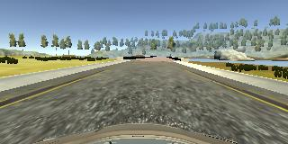
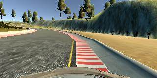
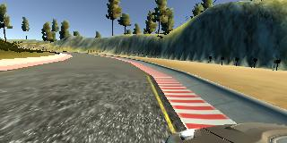

# Behavioral cloning

This project implements a machine-learning model for a self-driving car in the UDACITY simulator (Fig. 1). The model uses road images taken by three on-board cameras to predict steering angle.  The model is trained using the so-called  behavioural cloning approach. 

  
    <em>Fig. 1. Udacity self-driving car simulator.</em>

## Data
The goal of behavioural cloning is to reproduce human behaviours in a computer program. For a self-driving car the two most important behaviours are:

1. Normal driving i.e. driving in the middle of the lane;
2. Recovery from mistakes e.g. driving on the shoulder.

### Data collections

#### Normal driving
To recored normal driving behaviours I drive the car in the simulator keeping it in the center of the road and collect camera images and the corresponding steering angles.

  
    <em>Fig. 1. View from the central camera when the car is driving in the center the road.</em>

#### Recovery from shoulder
To record behaviours necessary for the car to recover from the shoulder I:

1. Drive the car to the shoulder; 
2. Steer wheels toward the center of the road;
3. Record camera images (Fig. 2) for about 1 second at low speed (about 1 mph) and assign a steering angles of 25&deg;. 

  
    <em>Fig. 2. View from the central camera when the car is on the shoulder.</em>

##### Synthetic data
To improve the recovery and smoothen self-driving I supplement the recovery data set with synthetic data points.
The underling idea is that the further the car is from the shoulder the lower steering angle needs to be for the car to recover to the middle of the road.
One way to generate such data set would be repeat steps 1-3 with the car slightly away from the shoulder and use a lower steering angle.
Here, instead of collecting additional data, I use left (right) camera image to approximate central camera image when the car is close to the right (left) shoulder.  Fig. 3 shows an example from the left camera when the car is on the right shoulder.

  
    <em>Fig. 3. View from the left camera when the car is on the right shoulder.</em>

## Model architecture design
My model is inspired by a paper from [NVIDIA](http://images.nvidia.com/content/tegra/automotive/images/2016/solutions/pdf/end-to-end-dl-using-px.pdf) [1] which describes a successful ConvNet architecture for training a self-driving car. I use this architecture as a starting point.
Compared to the NVIDIA model, my model has one less convolutional layer and one less fully connected layer.
Removing the last convolutional layer and one fully connected layer significantly speeds up the training and leads to similar validation errors. 
The convolutional filter sizes and number of filters are the same as in the NVIDIA paper.  The input image size is only slightly different than in the paper (200x60 vs 200x66 px).

Because my training data set is three orders of magnitude smaller than the one used by the authors (~minutes vs 72 hours) over-fitting is an issue. To prevent over-fitting I introduce two regularization strategies:

1. All but the last convolutional layer are followed by a 2x2 MaxPool layer. To preserve the layers output sizes, I reduce the stride in convolutional layers from two to one. 
2. All convolutional layers are followed by a dropout layer. 

In addition to the above changes, the output layer is followed by hyperbolic tangent to limit steering angle predictions to [-1, 1] range.

Overall, four convolutional layers each followed by a relu activation should provide enough capability to extract translationaly invariant and non-linear features.
Three fully connected layers, on the other hand, should effectively translate those features to steering angles. 

## Architecture characteristics
The final model architecture ensures that the volumes are decreasing at each layer i.e.  information flows from the input to the output layer.

* Layer 1: Input: 200x100x3, Output: 28x98x24, Convolutional: 5x5, Max Pooling: 2x2,  Dropout: 0.4,  Relu Activation
* Layer 2: Input: 28x98x24 Output: 12x47x36, Convolutional: 5x5, Max Pooling: 2x2,  Dropout: 0.4,  Relu Activation
* Layer 3: Input: 12x47x36, Output: 4x21x48, Convolutional: 5x5, Max Pooling: 2x2,  Dropout: 0.4,  Relu Activation
* Layer 4: Input: 4x21x48, Output: 2x19x64, Convolutional: 3x3, Dropout: 0.4,  Relu Activationn
* Layer 5: Input: 2432, Output: 1000, Fully Connected: 1000 neurons, Relu Activation
* Layer 6: Input: 1000, Output: 100, Fully Connected: 100 neurons, Relu Activation
* Layer 7: Input: 100, Output: 20, Fully Connected: 20 neurons, Relu Activation
* Layer 8: Input: 20, Output: 1, Fully Connected: 1 neuron, Tanh Activation 

## Data Preprocessing
1. Normalize image data to [-0.5, 0.5] range
2. Resize from 320x160 px to 200x100 px
3. Crop to 200x60 px. Here, I remove part of the image that is above the horizon and not directly in front of the car.

## Model Training.
To train the model I perform a grid search over two hyperparameters:  dropout and number of epochs.
To evaluate model I test its performance in the simulator. 
The model performs well in the simulator without crashing even after multiple loops with dropout of 0.4 and number of epochs equal to 8. 

I did not use validation set to evaluate the model performance because the data is strongly autocorrelated. Perhaps, better designed validation set , not a simple random sample of the train set, could remove some of the autcorrelation and lead to validation errors that reflect car self-driving ability.

[1] End to End Learning for Self-Driving Cars, NVIDIA, 2016, [arXiv:1604.07316][https://arxiv.org/abs/1604.07316]
