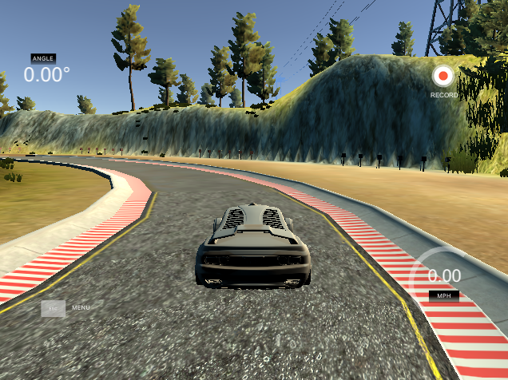

# Behavioral cloning

This project implements a machine learning model for self-driving car in a simulator. The model uses road images taken by three on-board cameras and predicts appropriate steering angle.  The model is trained using the so-called  behavioural cloning approach. 
In behavioural cloning we create a set of behaviours that we want the model to reproduce and then train the model on them. 
The most important behaviour for a self-driving car is to keep the car in the center of the road. 
In addition to reproducing "good" behaviours the model should also be able to prevent "bad" behaviours such as as driving off.

## Model details

### Data collections
The most important behaviour for a self-driving car is to keep the car in the center of the road. 
To reproduce this behaviours we drive a car in the simulator keeping car in the center of the road and collect camera images and the corresponding steering angels. Total number of 2000 data points were genrated.

To prevent "bad beavhours" we recorad camera images and sterring angles . This accomplisedh in two steps:
1. Drive the car to the side of the road
2. Steer wheels toward the center of the road
3. Record camara images and steering angles (25 ${\textdegree}$) for about 1 second.
I repeat this procedure for both sides of the road. Total numbe of 300 data points were generated.  

To smoothen the steering angles I also use generate sythetic data points using left and right camaras. 
When 5 \deg 

`df_edges_right.loc[:, 'center'] = df_edges_right.apply( lambda x: x.right[26:], axis=1)`

In addtion to smoothen the "potential well"
### Preprocessing

### Model architecture 

- Layer 1:
Convolutional (Input = 32x32x1. Output = 28x28x10)
Relu Activation
Max Pooling (Input = 28x28x10. Output = 14x14x10)

- Layer 2:
Convolutional (Input = 14x14x10. Output = 10x10x24)
Relu Activation
Max Pooling (Input = 10x10x24. Output = 5x5x24)

- Layer 3:
Fully Connected (Input = 600. Output = 200)
Relu Activation
Layer 4:
Fully Connected (Input = 200. Output = 100)
Relu Activation
Layer 5:
Fully Connected (Input = 100. Output = 43)

Is the model architecture documented?

The README provides sufficient details of the characteristics and qualities of the architecture, such as the type of model used, the number of layers, the size of each layer. Visualizations emphasizing particular qualities of the architecture are encouraged.

Is the creation of the training dataset and training process documented?

The README describes how the model was trained and what the characteristics of the dataset are. Information such as how the dataset was generated and examples of images from the dataset should be included.
